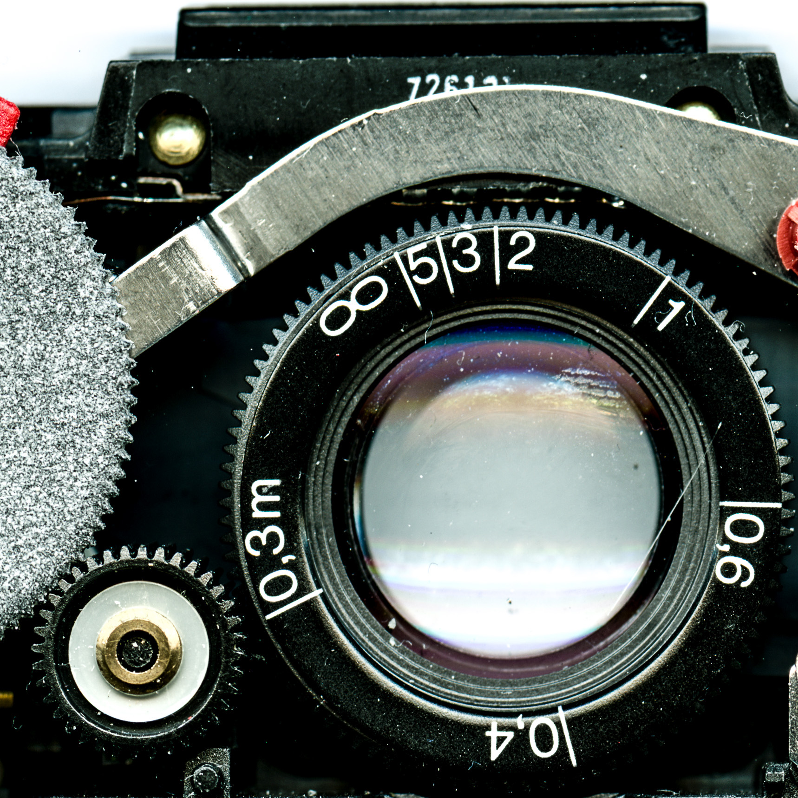

I have been struggling with this one lately. You know, and it’s true, that I always say that I am terrible at repairs, and, I have to say because people assume I should be, but it’s like saying that a person that knows all the medical theory can perform an operation off the bat. Believe me: I have killed so many (metaphorical) patients.

## **What is not restoration**

I don’t consider restoration skinning your camera, painting it, or otherwise pimping it. Don’t get me wrong, i love all those things, but those are not restoration. Actually if you want to skin your camera (and there’s some amazing options nowadays, including [the classic tan](http://aki-asahi.com/store/html/SX_O-brown/index.php) as close as you are going to original, as well as much more. If you feel more adventurous you can check the sometimes crazy designs by [@pola_dress](https://www.etsy.com/shop/PolaDress) and  [@sxivy](https://www.etsy.com/shop/SXIVY) when he is not taking a break.

## Repair vs restoration

Let me say this up front, repairs are a waste of money (unless they are on top of a restoration). Yes, you heard me right.
These cameras have 40-50ish years on their body, luckily they were built with the best materials, but even if they have been treated properly and with love, some parts are going to give up, curiously later models are more prone to failure that some of the older ones: so please be kind and have your camera restored.

## So what IS a restoration

A proper restoration of course fixes your camera, makes it whole, but also tries to prevent things that we know will eventually go south. I am going to list a few operations that I think are essentials:
-cleaning all surfaces, especially those regarding the optical path.
-non-destructive total removal of the old skin
-motor refurbishing or better yet replacement with new old stock.
-replacement of any deteriorated flex pcbs and cable.
-removal of any fungus on the lens
-lens calibration to infinity
-test of the flash firing assembly with a proper tool (yes, more on tools later).
-clean up or better yet, replacement for a new one of the IR filter of the electric eye.
-check carefully all the soldering points on the ECM (Electronic Control Module in Polaroid lingo, is the main PCB, the brains of the camera. I am going to talk later about the ECMs.
-clean and check the rollers, pick arm, check operation in general.
-finally do a test picture
(there is also something you should not do, at least as a rule: lubrication. I have seen some videos lately that make me cringe: it is a documented “rule” that you don’t use lubricant (and when you do, you use a very specific one). That lube is going to eventually dry and mean trouble. Use isopropyl alcohol please.)

## original vs new

This is the question, you want to keep it “as original as possible” or you want a camera that LOOKS original but with some modern stuff inside so you know that works better and opens new creative options. I choose the second, but with a few caveats, in any case, if you choose the first option, let me give you a piece of advice: steer away from Fairchild ECMs.

## tools of the trade

Polaroid designed quite a few custom tools for the SX70. Some are ubiquitous like the 1mm square screwdriver, to the hard to find like the custom pliers to the legendary, such as comprehensive tester B. 
Most folks with tools usually have a limited set. Those that have survived to present day are probably a combination of the most practical and the most resilient. 
We could probably off the bat differentiate those shops that have original tools or replicas and those that don’t.
Is it that important? My personal opinion is that these are nice to have but not essential. I can remember how Matt Widmann basically started a revolution in the art of refurbishment and customization without any of the original tools. He has created a trend, and SX70 repairs will never be the same.

## options

There’s quite a few options these days, one could even say that the scene is a bit overcrowded. But that is good, and gives the public more options and styles.
There’s the techs that we can call Polaroid trained, and those that have self taught the art of repairs.
Also some are trying to “industrialize” the process to very high standards, and those that are just enthusiasts that love what they do. They work for the love of the game.